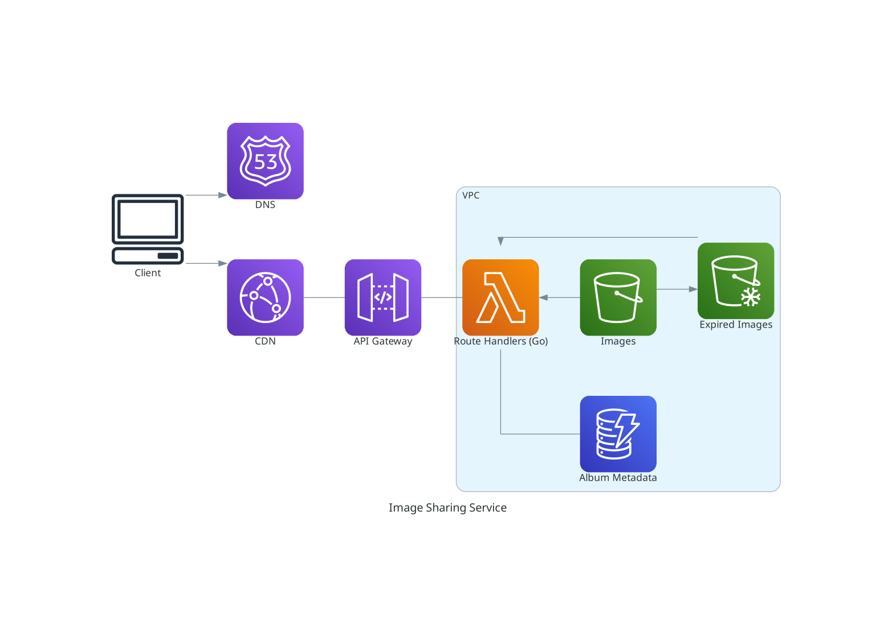

# Image Sharing Service



## Supported Actions

- **[Upload]** Photographers create an Event in the UI. They can then upload 
images to the event by dragging and dropping from their local drive, or 
selecting with the iOS/Android photo selector. 
The photos are then bound to a randomly generated access code, which is given
to the photo subjects to view their photos at the specific event url.
- **[View]** A viewing user visits the link in their browser, and a text box 
appears, prompting for the access code.
Once authenticated, the photos in the album appear in a grid. 
The user has the option to download all, one, or a subset of the photos. 
There is a timer displaying the days/hours left before the photos are deleted.

## Data Model

Photo albums are oriented around "events", which contain a large set of photos.
Events have unique generated urls, and the album owners can share subsets of the
photos to specific people by generating "access codes".

Photographers can create an event, upload some images to it, and give subjects
the access code which lets them see only their photos.

Only photographers need to create an account to manage their events and upload
photos. Viewers of the photos only need to type in the access code.

### Database

This project will use DynamoDB since I'm expecting low utilization, so a serverless option which scales to zero will be cheaper than a provisioned database like RDS.

As a result, my data model must be document oriented.

There will be three tables,

1. Users
2. Events
3. Accessors

The Users table will map user emails to a UUID and store other metadata about the user.

The Events table will map each Event to a UUID and store metadata about the event.

The Access Codes table will map Access Codes to Events, and which photos within that Event this code is authorized to see.

**Users**

```json
{
    "user_email": "example@domain.com",
    "user_name": "example",
    "user_id": "f779de91-995a-4e8d-a2d6-24a5cb37d8bd"
}
```

**Events**

```json
{
    "event_name": "Example Event Name",
    "bucket_prefix": "s3://imgsh-test/",
    "event_id": "fd575f0d-f39a-4ecb-99f9-31813d4edb2c",
    "user_id": "f779de91-995a-4e8d-a2d6-24a5cb37d8bd",
    "public_url": "example/example_event_name",
    "creation_date": "YYYY-MM-DD",
    "seconds_to_live": "604800"
}
```

The full S3 path is obtained by appending the event_id to the bucket prefix.

The public url that people see will be prefixed with the owner's username, to keep links short and readable.

`seconds_to_live` stores the time for which the Event should be accessible in seconds since `creation_date`. `creation_date` + `seconds_to_live` = expiry date.

**Accessors**

```json
{
    "event_id": "fd575f0d-f39a-4ecb-99f9-31813d4edb2c",
    "access_code": "ABC34D",
    "images": [
        "pic1.png",
        "pic2.png",
        "pic4.png",
        "pic9.png" 
    ]
}
```


### S3

The S3 bucket will follow a directory structure that uses prefixes to narrow down the images.

The parent bucket will contain directories named by their owner's uuid, then by the event uuid.

This structure should allow for fast throughput, since S3 request speed is per prefix.


The structure will resemble the following.

```
imgsh/
└── user_id/
    └── event_id/
        └── filename.png
```

Here is an example of what it might look like,

```
imgsh/
├── df632a03-0222-412f-874d-29525c226fc6/
│   ├── cd20a0b0-556e-4c8d-8550-0a26c1c668c4/
│   │   ├── wedding_dress.png
│   │   ├── getting_ready.png
│   │   ├── bride_portraits.png
│   │   ├── rings.png
│   │   ├── cake.png
│   │   └── guests.png
│   └── b9bc58bc-3ceb-46a0-a38b-a9109307ddb0/
│       ├── Eiffel_tower.png
│       └── Louvre.png
├── e62dcf9e-381f-49f0-af55-f4bd4e13180b/
│   └── ab323053-438e-40cc-a16d-eb52cf56b58e/
│       ├── happy_birthday.mp4
│       ├── cake.png
│       └── silly_one.png
└── 5c3832ec-5132-4409-962c-27853b33e54f/
    └── 88313bd0-4a3b-4e0e-a00b-d101ad166cea/
        ├── Gouda.png
        ├── Brie.png
        └── Camembert.png
```

## API
