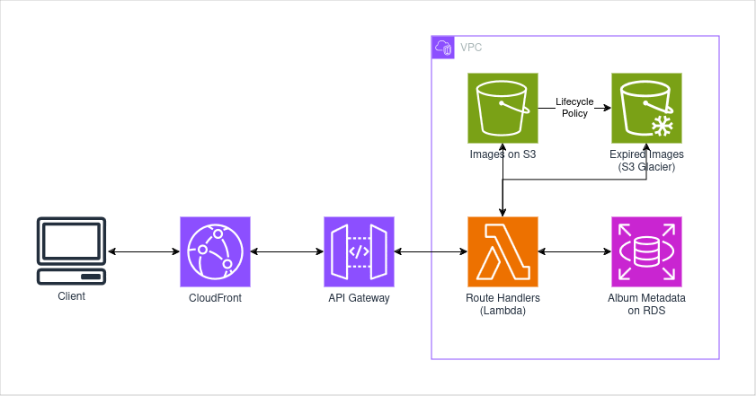

# Image Sharing Service

## Supported Actions

- **[Upload]** Uploading user selects several photos from their local drive, then clicks "create album". 
They have the option to add a password to the album, or make it public.
The page triggers a redirect to their photo album, with a sharing link, qr code, and auto-generated password.
- **[View]** A viewing user visits the link in their browser, and a text box appears, prompting for the password (if applicable).
Once authenticated, the photos in the album appear in a grid. 
The user has the option to download all, one, or a subset of the photos. 
There is a timer displaying the days/hours left before the photos are deleted.

## Flow

- **[Upload]**
  - Browser triggers image picker, user selects photos, and clicks "create album".
  - frontend triggers a "create album" request, which returns an S3 presigned url.
    - A lambda function creates a randomly named S3 bucket and generates a presigned URL to it, then forwards it to the frontend.
  - The selected images are placed into the bucket by the frontend. The user is directed to the album page.
- **[View]** 
  - The user visits the link or scans the qr code.
  - The request will reach the API gateway and lambda function with the correct route.
  - Based on the name of the album, the lambda function reads the album metadata from the RDS database, the url of the S3 bucket, and whether the album is password protected.
    - If password protected, the function will return the password screen. 
    - If correct, continue to the next step.
  - Frontend recieves the presigned url to the S3 bucket, then requests the content from CloudFront. (Cloudfront domain + S3 url)
  - CloudFront + S3 returns
    - First, thumbnail quality images.
    - Then/Lazily, the full quality images.